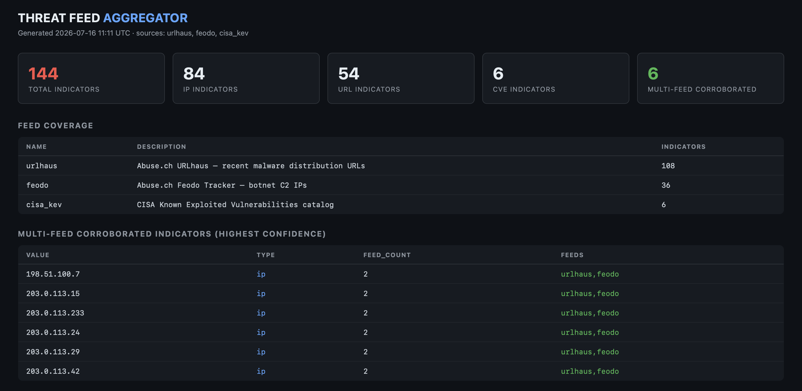
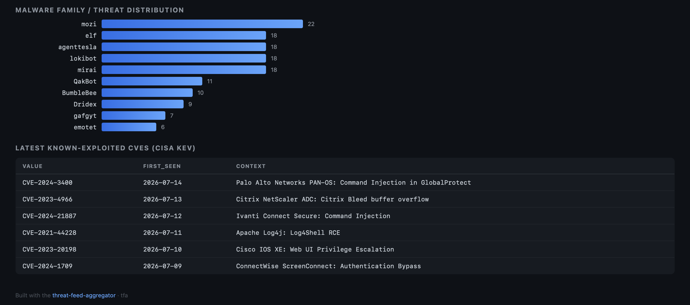

# Threat Feed Aggregator

Pulls open threat intelligence feeds, normalises every indicator into a
relational schema, correlates across sources and renders a SOC-style
dashboard (a single self-contained HTML file with no framework
dependencies).




The core idea is corroboration. Any one feed contains noise; an indicator
independently reported by two unrelated feeds is a materially stronger
signal. Feeds report in incompatible shapes: URLhaus publishes full
malware-distribution URLs while Feodo publishes bare C2 IP addresses, so
naive matching finds zero overlap. The aggregator derives a host-level
indicator from every URL, which is what makes cross-feed correlation
actually work.

## Feeds

| Feed | Type | Auth |
|---|---|---|
| Abuse.ch URLhaus | Malware distribution URLs (+ derived hosts) | none |
| Abuse.ch Feodo Tracker | Botnet C2 IPs | none |
| CISA KEV | Known exploited vulnerabilities | none |

Parsers are separated from fetchers, so each parser is unit-testable
offline, and one failing feed never sinks the run.

## Run it

```
python run.py --demo    # bundled sample data, fully offline
python run.py --live    # fetch the real feeds
```

Both modes ingest into SQLite (`threats.db`), print a summary and the
corroborated indicator set, and write `output/dashboard.html`.

The sample data uses RFC 5737 documentation address ranges
(203.0.113.0/24, 198.51.100.0/24) and `example` domains, so nothing in
the offline dataset points at real infrastructure. CVE identifiers are
real, public entries from the KEV catalog.

## Schema

Three tables: `feeds`, `indicators` (deduplicated on value + type), and
`sightings` (one row per feed-observation of an indicator). The
corroboration query is a two-join GROUP BY with a HAVING clause on
distinct feed count, see `tfa/analyse.py`, which keeps all the
analytical SQL in one readable place.

SQLite is used so the demo needs zero setup; the schema ports to
PostgreSQL unchanged apart from AUTOINCREMENT syntax.

## Tests

`tests/test_tfa.py` covers parser output, host derivation, cross-feed
correlation, duplicate-sighting suppression, and dashboard rendering.
Run with `python -m pytest tests/`.

## Roadmap

Scheduled ingestion (cron), feed reliability weighting, STIX 2.1 export,
and an ASN/geolocation enrichment pass.

---
*Built by Sahifa Syed - BSc Cyber Security & Digital Forensics (First
Class), UWE Bristol. Related: my
[OSINT verification toolkit](https://github.com/sahifasyed/OSINT-Investigation-Toolkit).*
